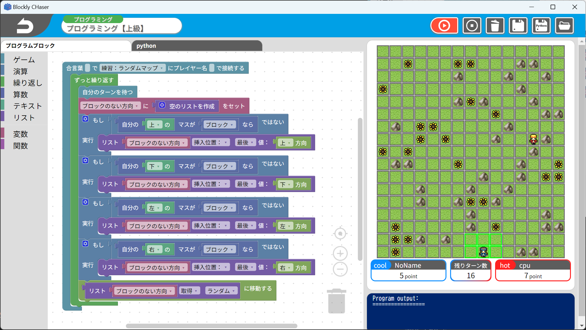

# U15一関プロコンサーバー
Combine Google Blockly and Procon Game Server.

U15一関プロコンサーバーは[U-15プログラミングコンテスト一関](https://procon-ichinoseki.com/)での使用を想定したサーバです。
[U-15長野プログラミングコンテスト](https://www.nagano-cci.or.jp/u15procon/)用に開発されたU15長野プロコンサーバーを一関仕様に改良しました。
ビジュアルプログラミングの一つである[blockly](https://github.com/google/blockly)を用いてプログラミング初学者が気軽にプログラミングコンテストに参加できる環境づくりを目指しています。
ゲーム仕様は[AsahikawaProcon-Server](https://github.com/hal1437/AsahikawaProcon-Server)を参考にブラウザ上でゲームの実行が可能です。



## 機能
- プログラミング
	- プログラムの実行・停止
	- ゲーム用ブロックの追加
	- エラー表示
	- プログラムの保存
		- 保存ボタンによる手動保存(JSON圧縮形式)
		- プログラム実行時の自動保存
	- プログラムのロード
		- 開くボタンによる任意プログラムのロード
		- 前回実行したプログラムのロード
	- コードの表示
		- Python
		- JavaScript
	- 上級編
- チュートリアル
	- 操作方法等のチュートリアルページ
- ゲーム
    - ゲームの開始・終了
    - マップ自動生成
    - CPU対戦
    - 他プレイヤー同士のゲーム観戦

## 動作環境
### 動作確認済み環境
- Windows 11 / macOS 14
- Node.js 14.x

### 推奨環境
- 《Dockerfile掲載予定》

## セットアップ
- Step.0:Node.js,npm インストール
- Step.1:任意の場所でGitのリポジトリをクローン
```bash
git clone https://github.com/U15-Ichinoseki/blockly-chaser-ichinoseki.git
```

- Step.2:ダウンロードしたフォルダに移動後、パッケージをインストール
```bash
cd ./blockly-procon
npm install
```

- Step.3:起動
```bash
npm start
```

## 動作確認
- ブラウザから `http://<IPaddress>:<Port(default:3000)>/` にアクセス

## アプリ化方法
- Step.0:アプリケーションをビルド可能な環境であることを確認
  - Linux環境でビルドを行う場合はwineのインストールが必要
  - macOS版はmacOSが必要

- Step.1:スクリプトの実行

|OS|コマンド|
|--|--|
|Windows|`npm run dist-win`|
|macOS|`npm run dist-mac`|

- Step.2:フォルダー『dist』内にアプリ化されたファイルが生成される

## 実装予定


## Contributing
[CONTRIBUTING.md](.github/CONTRIBUTING.md)

## Licence
[LICENSE](.github/LICENSE)

本製作物には一部[Apache License 2.0](.github/ApacheLicense)で配布されている製作物が含まれています。